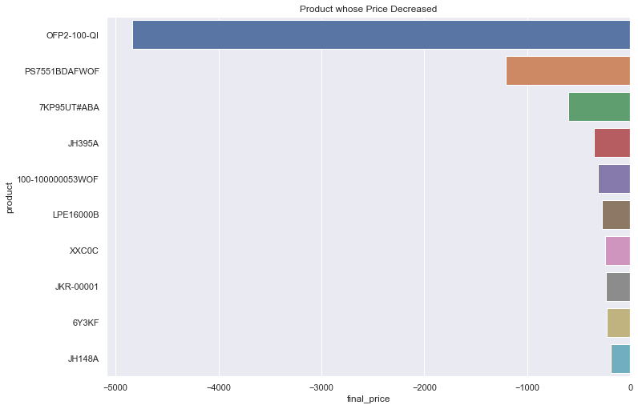
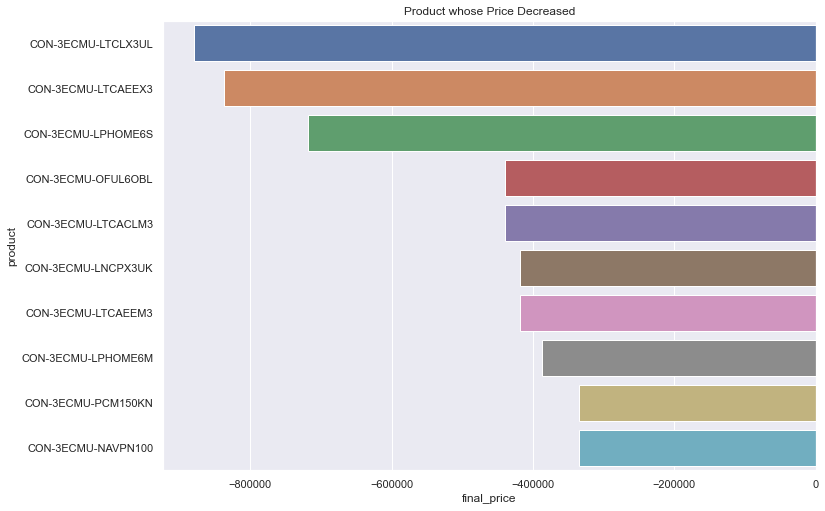

# Project IMUS

## Dataset description:

### What is an IMU?

An inertial measurement unit (IMU) measures and reports raw or filtered angular rate and specific force/acceleration experienced by the object it is attached to. Data outputs for an IMU are typically body-frame accelerations, angular rates, and (optionally) magnetic field measurements.

## The columns of the dataset are:

1. Category: The category to which this IMU belongs.

2. Manufacturer: Name of the manufacturer.

3. part number: Discrete part number

4. sku: stock keeping unit

5. alt_sku: alternate stock keeping unit

6. Description: description of the product

7. Status: Whether it is in stock or not

8. Quantity: Quantity available

9. Price: Price of the product

10. sku_create_date: when was the product procured

## Importing Related Resources


```python
import pandas as pd
import numpy as np
pd.plotting.register_matplotlib_converters()
import matplotlib.pyplot as plt
%matplotlib inline
import seaborn as sns
```


```python
file ='imus.xlsx'
```


```python
df = pd.concat(pd.read_excel("imus.xlsx",sheet_name= None),ignore_index = True) # dedining df variable to file , merging of all sheet with concat method.
```

## Pre-Processing

### Intial Insepection


```python
df.head() 
```


<div>
<style scoped>
    .dataframe tbody tr th:only-of-type {
        vertical-align: middle;
    }

    .dataframe tbody tr th {
        vertical-align: top;
    }

    .dataframe thead th {
        text-align: right;
    }
</style>
<table border="1" class="dataframe">
  <thead>
    <tr style="text-align: right;">
      <th></th>
      <th>category</th>
      <th>manufacturer</th>
      <th>part_number</th>
      <th>sku</th>
      <th>alt_sku</th>
      <th>description</th>
      <th>status</th>
      <th>qty</th>
      <th>price</th>
      <th>sku_create_date</th>
    </tr>
  </thead>
  <tbody>
    <tr>
      <th>0</th>
      <td>1539</td>
      <td>MS-OPEN VALUE SUBSCRIPTION</td>
      <td>021-09108</td>
      <td>BA0011</td>
      <td>NaN</td>
      <td>1YR OFFICESTD ALNG LICSAPK OLV, D AP</td>
      <td>No Stock</td>
      <td>0</td>
      <td>143.58</td>
      <td>2020-08-17</td>
    </tr>
    <tr>
      <th>1</th>
      <td>1539</td>
      <td>MS-OPEN VALUE SUBSCRIPTION</td>
      <td>059-07014</td>
      <td>BA0025</td>
      <td>NaN</td>
      <td>1YR WORD ALNG LICSAPK OLV D AP,</td>
      <td>No Stock</td>
      <td>0</td>
      <td>56.09</td>
      <td>2020-08-17</td>
    </tr>
    <tr>
      <th>2</th>
      <td>1539</td>
      <td>MS-OPEN VALUE SUBSCRIPTION</td>
      <td>065-06444</td>
      <td>BA0039</td>
      <td>NaN</td>
      <td>1YR EXCEL ALNG LICSAPK OLV D AP,</td>
      <td>No Stock</td>
      <td>0</td>
      <td>56.09</td>
      <td>2020-08-17</td>
    </tr>
    <tr>
      <th>3</th>
      <td>1539</td>
      <td>MS-OPEN VALUE SUBSCRIPTION</td>
      <td>076-04355</td>
      <td>BA0067</td>
      <td>NaN</td>
      <td>1YR PRJCT ALNG LICSAPK OLV D AP,</td>
      <td>No Stock</td>
      <td>0</td>
      <td>217.60</td>
      <td>2020-08-17</td>
    </tr>
    <tr>
      <th>4</th>
      <td>1582</td>
      <td>MS-OPEN VALUE SUBSCRIPTION</td>
      <td>077-05318</td>
      <td>BA0080</td>
      <td>NaN</td>
      <td>1YR ACCESS ALNG LICSAPK OLV D, AP</td>
      <td>No Stock</td>
      <td>0</td>
      <td>56.09</td>
      <td>2020-08-17</td>
    </tr>
  </tbody>
</table>
</div>


```python
print('Number of Rows and Columns in dataset',df.shape,'.')
```

    Number of Rows and Columns in dataset (2627926, 10) .
    


```python
print('Data Type of each column:')
df.dtypes
```

    Data Type of each column:
    


    category                    int64
    manufacturer               object
    part_number                object
    sku                        object
    alt_sku                    object
    description                object
    status                     object
    qty                         int64
    price                     float64
    sku_create_date    datetime64[ns]
    dtype: object


```python
print('Four type of columns in dataset.')
df.dtypes.value_counts()
```

    Four type of columns in dataset.
    


    object            6
    int64             2
    float64           1
    datetime64[ns]    1
    dtype: int64


###  Concise Summary of a DataFrame


```python
df.info()
```

    <class 'pandas.core.frame.DataFrame'>
    RangeIndex: 2627926 entries, 0 to 2627925
    Data columns (total 10 columns):
     #   Column           Dtype         
    ---  ------           -----         
     0   category         int64         
     1   manufacturer     object        
     2   part_number      object        
     3   sku              object        
     4   alt_sku          object        
     5   description      object        
     6   status           object        
     7   qty              int64         
     8   price            float64       
     9   sku_create_date  datetime64[ns]
    dtypes: datetime64[ns](1), float64(1), int64(2), object(6)
    memory usage: 200.5+ MB
    

## Cleaning of dataset for further analysis


```python
df = df.astype({"category":'category'}) # changing type of category.
```


```python

```

### Checking null type of data in dataframe


```python
df.isnull().sum()
```


    category                 0
    manufacturer             0
    part_number              0
    sku                      0
    alt_sku            2613442
    description              0
    status                   0
    qty                      0
    price                    0
    sku_create_date          0
    dtype: int64


lot of null value in alt_sku so better to drop it for further analysis.

### Droping extra columns


```python
df.drop(['sku','alt_sku','description'], axis=1, inplace=True)
```


```python
df.head()
```


<div>
<style scoped>
    .dataframe tbody tr th:only-of-type {
        vertical-align: middle;
    }

    .dataframe tbody tr th {
        vertical-align: top;
    }

    .dataframe thead th {
        text-align: right;
    }
</style>
<table border="1" class="dataframe">
  <thead>
    <tr style="text-align: right;">
      <th></th>
      <th>category</th>
      <th>manufacturer</th>
      <th>part_number</th>
      <th>status</th>
      <th>qty</th>
      <th>price</th>
      <th>sku_create_date</th>
    </tr>
  </thead>
  <tbody>
    <tr>
      <th>0</th>
      <td>1539</td>
      <td>MS-OPEN VALUE SUBSCRIPTION</td>
      <td>021-09108</td>
      <td>No Stock</td>
      <td>0</td>
      <td>143.58</td>
      <td>2020-08-17</td>
    </tr>
    <tr>
      <th>1</th>
      <td>1539</td>
      <td>MS-OPEN VALUE SUBSCRIPTION</td>
      <td>059-07014</td>
      <td>No Stock</td>
      <td>0</td>
      <td>56.09</td>
      <td>2020-08-17</td>
    </tr>
    <tr>
      <th>2</th>
      <td>1539</td>
      <td>MS-OPEN VALUE SUBSCRIPTION</td>
      <td>065-06444</td>
      <td>No Stock</td>
      <td>0</td>
      <td>56.09</td>
      <td>2020-08-17</td>
    </tr>
    <tr>
      <th>3</th>
      <td>1539</td>
      <td>MS-OPEN VALUE SUBSCRIPTION</td>
      <td>076-04355</td>
      <td>No Stock</td>
      <td>0</td>
      <td>217.60</td>
      <td>2020-08-17</td>
    </tr>
    <tr>
      <th>4</th>
      <td>1582</td>
      <td>MS-OPEN VALUE SUBSCRIPTION</td>
      <td>077-05318</td>
      <td>No Stock</td>
      <td>0</td>
      <td>56.09</td>
      <td>2020-08-17</td>
    </tr>
  </tbody>
</table>
</div>


### Renaming columns for convience 


```python
df = df.rename(columns={'sku_create_date': 'date', 'part_number': 'product'})
```


```python
df.head()
```


<div>
<style scoped>
    .dataframe tbody tr th:only-of-type {
        vertical-align: middle;
    }

    .dataframe tbody tr th {
        vertical-align: top;
    }

    .dataframe thead th {
        text-align: right;
    }
</style>
<table border="1" class="dataframe">
  <thead>
    <tr style="text-align: right;">
      <th></th>
      <th>category</th>
      <th>manufacturer</th>
      <th>product</th>
      <th>status</th>
      <th>qty</th>
      <th>price</th>
      <th>date</th>
    </tr>
  </thead>
  <tbody>
    <tr>
      <th>0</th>
      <td>1539</td>
      <td>MS-OPEN VALUE SUBSCRIPTION</td>
      <td>021-09108</td>
      <td>No Stock</td>
      <td>0</td>
      <td>143.58</td>
      <td>2020-08-17</td>
    </tr>
    <tr>
      <th>1</th>
      <td>1539</td>
      <td>MS-OPEN VALUE SUBSCRIPTION</td>
      <td>059-07014</td>
      <td>No Stock</td>
      <td>0</td>
      <td>56.09</td>
      <td>2020-08-17</td>
    </tr>
    <tr>
      <th>2</th>
      <td>1539</td>
      <td>MS-OPEN VALUE SUBSCRIPTION</td>
      <td>065-06444</td>
      <td>No Stock</td>
      <td>0</td>
      <td>56.09</td>
      <td>2020-08-17</td>
    </tr>
    <tr>
      <th>3</th>
      <td>1539</td>
      <td>MS-OPEN VALUE SUBSCRIPTION</td>
      <td>076-04355</td>
      <td>No Stock</td>
      <td>0</td>
      <td>217.60</td>
      <td>2020-08-17</td>
    </tr>
    <tr>
      <th>4</th>
      <td>1582</td>
      <td>MS-OPEN VALUE SUBSCRIPTION</td>
      <td>077-05318</td>
      <td>No Stock</td>
      <td>0</td>
      <td>56.09</td>
      <td>2020-08-17</td>
    </tr>
  </tbody>
</table>
</div>


### Dividing Dataset on basis of availablity of stock.


```python
print('Stock availablity:')
df['status'].value_counts()
```

    Stock availablity:
    


    No Stock    1914138
    In Stock     713788
    Name: status, dtype: int64


```python
df_st= df[df.status == 'In Stock']
```


```python
df_nos= df[df.status == 'No Stock']
```

## For data In Stock:


```python
df_st.head()
```


<div>
<style scoped>
    .dataframe tbody tr th:only-of-type {
        vertical-align: middle;
    }

    .dataframe tbody tr th {
        vertical-align: top;
    }

    .dataframe thead th {
        text-align: right;
    }
</style>
<table border="1" class="dataframe">
  <thead>
    <tr style="text-align: right;">
      <th></th>
      <th>category</th>
      <th>manufacturer</th>
      <th>product</th>
      <th>status</th>
      <th>qty</th>
      <th>price</th>
      <th>date</th>
    </tr>
  </thead>
  <tbody>
    <tr>
      <th>253</th>
      <td>9920</td>
      <td>CASE LOGIC-PERSONAL &amp; PORTABLE</td>
      <td>3200943</td>
      <td>In Stock</td>
      <td>7</td>
      <td>99.00</td>
      <td>2020-08-17</td>
    </tr>
    <tr>
      <th>271</th>
      <td>531</td>
      <td>OMNITRON SYSTEMS</td>
      <td>7206-0</td>
      <td>In Stock</td>
      <td>2</td>
      <td>59.09</td>
      <td>2020-08-17</td>
    </tr>
    <tr>
      <th>320</th>
      <td>9070</td>
      <td>ZEBRA ENTERPRISE MCD-A1</td>
      <td>SAC5070-800CR</td>
      <td>In Stock</td>
      <td>3</td>
      <td>500.06</td>
      <td>2020-08-17</td>
    </tr>
    <tr>
      <th>324</th>
      <td>9080</td>
      <td>ZEBRA ENTERPRISE MCD-A1</td>
      <td>KT-CLMPT-RS507-01R</td>
      <td>In Stock</td>
      <td>115</td>
      <td>86.34</td>
      <td>2020-08-17</td>
    </tr>
    <tr>
      <th>326</th>
      <td>9080</td>
      <td>ZEBRA ENTERPRISE MCD-A1</td>
      <td>KT-PAD-RS507-10R</td>
      <td>In Stock</td>
      <td>42</td>
      <td>51.80</td>
      <td>2020-08-17</td>
    </tr>
  </tbody>
</table>
</div>


```python
df_st.drop(["status"], axis=1) # no need of stock column now so dropping
```


```python
df_st
```


<div>
<style scoped>
    .dataframe tbody tr th:only-of-type {
        vertical-align: middle;
    }

    .dataframe tbody tr th {
        vertical-align: top;
    }

    .dataframe thead th {
        text-align: right;
    }
</style>
<table border="1" class="dataframe">
  <thead>
    <tr style="text-align: right;">
      <th></th>
      <th>category</th>
      <th>manufacturer</th>
      <th>product</th>
      <th>qty</th>
      <th>price</th>
      <th>date</th>
    </tr>
  </thead>
  <tbody>
    <tr>
      <th>253</th>
      <td>9920</td>
      <td>CASE LOGIC-PERSONAL &amp; PORTABLE</td>
      <td>3200943</td>
      <td>7</td>
      <td>99.00</td>
      <td>2020-08-17</td>
    </tr>
    <tr>
      <th>271</th>
      <td>531</td>
      <td>OMNITRON SYSTEMS</td>
      <td>7206-0</td>
      <td>2</td>
      <td>59.09</td>
      <td>2020-08-17</td>
    </tr>
    <tr>
      <th>320</th>
      <td>9070</td>
      <td>ZEBRA ENTERPRISE MCD-A1</td>
      <td>SAC5070-800CR</td>
      <td>3</td>
      <td>500.06</td>
      <td>2020-08-17</td>
    </tr>
    <tr>
      <th>324</th>
      <td>9080</td>
      <td>ZEBRA ENTERPRISE MCD-A1</td>
      <td>KT-CLMPT-RS507-01R</td>
      <td>115</td>
      <td>86.34</td>
      <td>2020-08-17</td>
    </tr>
    <tr>
      <th>326</th>
      <td>9080</td>
      <td>ZEBRA ENTERPRISE MCD-A1</td>
      <td>KT-PAD-RS507-10R</td>
      <td>42</td>
      <td>51.80</td>
      <td>2020-08-17</td>
    </tr>
    <tr>
      <th>...</th>
      <td>...</td>
      <td>...</td>
      <td>...</td>
      <td>...</td>
      <td>...</td>
      <td>...</td>
    </tr>
    <tr>
      <th>2627921</th>
      <td>9945</td>
      <td>VERBATIM CORPORATION</td>
      <td>93975</td>
      <td>12</td>
      <td>50.53</td>
      <td>2020-08-28</td>
    </tr>
    <tr>
      <th>2627922</th>
      <td>9945</td>
      <td>VERBATIM CORPORATION</td>
      <td>93975</td>
      <td>12</td>
      <td>50.53</td>
      <td>2020-08-28</td>
    </tr>
    <tr>
      <th>2627923</th>
      <td>9945</td>
      <td>VERBATIM CORPORATION</td>
      <td>93975</td>
      <td>12</td>
      <td>50.53</td>
      <td>2020-08-28</td>
    </tr>
    <tr>
      <th>2627924</th>
      <td>9945</td>
      <td>VERBATIM CORPORATION</td>
      <td>93975</td>
      <td>12</td>
      <td>50.53</td>
      <td>2020-08-28</td>
    </tr>
    <tr>
      <th>2627925</th>
      <td>9945</td>
      <td>VERBATIM CORPORATION</td>
      <td>93975</td>
      <td>12</td>
      <td>50.53</td>
      <td>2020-08-28</td>
    </tr>
  </tbody>
</table>
<p>713788 rows × 6 columns</p>
</div>


### 1. Which are the top Manufacturers with price, quantity?


```python
mfg_grp = df_st.groupby('manufacturer').sum()
```


```python
mfg_sort = mfg_grp.sort_values(by=['qty', 'price'],ascending= False)[:10]
```


```python
mfg_sort_in = mfg_sort.reset_index()
```


```python
mfg_sort_in
```


<div>
<style scoped>
    .dataframe tbody tr th:only-of-type {
        vertical-align: middle;
    }

    .dataframe tbody tr th {
        vertical-align: top;
    }

    .dataframe thead th {
        text-align: right;
    }
</style>
<table border="1" class="dataframe">
  <thead>
    <tr style="text-align: right;">
      <th></th>
      <th>manufacturer</th>
      <th>qty</th>
      <th>price</th>
    </tr>
  </thead>
  <tbody>
    <tr>
      <th>0</th>
      <td>STARTECH.COM</td>
      <td>16069681</td>
      <td>7266737.29</td>
    </tr>
    <tr>
      <th>1</th>
      <td>DELL CSG SERVICE WARRANTIES</td>
      <td>13578833</td>
      <td>150917.91</td>
    </tr>
    <tr>
      <th>2</th>
      <td>TRIPP LITE CONNECTIVITY</td>
      <td>8283765</td>
      <td>768146.62</td>
    </tr>
    <tr>
      <th>3</th>
      <td>LOGITECH - COMPUTER ACCESSORIES</td>
      <td>8251159</td>
      <td>1005042.67</td>
    </tr>
    <tr>
      <th>4</th>
      <td>JABRA BUSINESS</td>
      <td>4829490</td>
      <td>392963.51</td>
    </tr>
    <tr>
      <th>5</th>
      <td>PLANTRONICS INC</td>
      <td>3825984</td>
      <td>703634.71</td>
    </tr>
    <tr>
      <th>6</th>
      <td>CONFIG 6</td>
      <td>3825896</td>
      <td>2140.78</td>
    </tr>
    <tr>
      <th>7</th>
      <td>BELKIN - CABLES</td>
      <td>3508335</td>
      <td>262931.76</td>
    </tr>
    <tr>
      <th>8</th>
      <td>DELL ESG WARRANTIES</td>
      <td>3149689</td>
      <td>173018.32</td>
    </tr>
    <tr>
      <th>9</th>
      <td>EPOS</td>
      <td>3127008</td>
      <td>1127406.70</td>
    </tr>
  </tbody>
</table>
</div>


```python
sns.set(rc={'figure.figsize':(11.7,8.27)})
top_mfg_qty_price = sns.barplot(x = 'qty',y = 'price',hue="manufacturer",  data= mfg_sort_in).set(title='Top Manufacturers with Price, Quantity')
```


    

    


```python

```

### 2. Which are the most profitable products?


```python
df_st['Total_Price'] =df_st['qty']*df_st['price']
```

    C:\Users\Mohit\AppData\Local\Temp/ipykernel_7272/1120783067.py:1: SettingWithCopyWarning: 
    A value is trying to be set on a copy of a slice from a DataFrame.
    Try using .loc[row_indexer,col_indexer] = value instead
    
    See the caveats in the documentation: https://pandas.pydata.org/pandas-docs/stable/user_guide/indexing.html#returning-a-view-versus-a-copy
      df_st['Total_Price'] =df_st['qty']*df_st['price']
    


```python
df_st
```


<div>
<style scoped>
    .dataframe tbody tr th:only-of-type {
        vertical-align: middle;
    }

    .dataframe tbody tr th {
        vertical-align: top;
    }

    .dataframe thead th {
        text-align: right;
    }
</style>
<table border="1" class="dataframe">
  <thead>
    <tr style="text-align: right;">
      <th></th>
      <th>category</th>
      <th>manufacturer</th>
      <th>product</th>
      <th>qty</th>
      <th>price</th>
      <th>date</th>
      <th>Total_Price</th>
    </tr>
  </thead>
  <tbody>
    <tr>
      <th>253</th>
      <td>9920</td>
      <td>CASE LOGIC-PERSONAL &amp; PORTABLE</td>
      <td>3200943</td>
      <td>7</td>
      <td>99.00</td>
      <td>2020-08-17</td>
      <td>693.00</td>
    </tr>
    <tr>
      <th>271</th>
      <td>531</td>
      <td>OMNITRON SYSTEMS</td>
      <td>7206-0</td>
      <td>2</td>
      <td>59.09</td>
      <td>2020-08-17</td>
      <td>118.18</td>
    </tr>
    <tr>
      <th>320</th>
      <td>9070</td>
      <td>ZEBRA ENTERPRISE MCD-A1</td>
      <td>SAC5070-800CR</td>
      <td>3</td>
      <td>500.06</td>
      <td>2020-08-17</td>
      <td>1500.18</td>
    </tr>
    <tr>
      <th>324</th>
      <td>9080</td>
      <td>ZEBRA ENTERPRISE MCD-A1</td>
      <td>KT-CLMPT-RS507-01R</td>
      <td>115</td>
      <td>86.34</td>
      <td>2020-08-17</td>
      <td>9929.10</td>
    </tr>
    <tr>
      <th>326</th>
      <td>9080</td>
      <td>ZEBRA ENTERPRISE MCD-A1</td>
      <td>KT-PAD-RS507-10R</td>
      <td>42</td>
      <td>51.80</td>
      <td>2020-08-17</td>
      <td>2175.60</td>
    </tr>
    <tr>
      <th>...</th>
      <td>...</td>
      <td>...</td>
      <td>...</td>
      <td>...</td>
      <td>...</td>
      <td>...</td>
      <td>...</td>
    </tr>
    <tr>
      <th>2627921</th>
      <td>9945</td>
      <td>VERBATIM CORPORATION</td>
      <td>93975</td>
      <td>12</td>
      <td>50.53</td>
      <td>2020-08-28</td>
      <td>606.36</td>
    </tr>
    <tr>
      <th>2627922</th>
      <td>9945</td>
      <td>VERBATIM CORPORATION</td>
      <td>93975</td>
      <td>12</td>
      <td>50.53</td>
      <td>2020-08-28</td>
      <td>606.36</td>
    </tr>
    <tr>
      <th>2627923</th>
      <td>9945</td>
      <td>VERBATIM CORPORATION</td>
      <td>93975</td>
      <td>12</td>
      <td>50.53</td>
      <td>2020-08-28</td>
      <td>606.36</td>
    </tr>
    <tr>
      <th>2627924</th>
      <td>9945</td>
      <td>VERBATIM CORPORATION</td>
      <td>93975</td>
      <td>12</td>
      <td>50.53</td>
      <td>2020-08-28</td>
      <td>606.36</td>
    </tr>
    <tr>
      <th>2627925</th>
      <td>9945</td>
      <td>VERBATIM CORPORATION</td>
      <td>93975</td>
      <td>12</td>
      <td>50.53</td>
      <td>2020-08-28</td>
      <td>606.36</td>
    </tr>
  </tbody>
</table>
<p>713788 rows × 7 columns</p>
</div>


```python
pr_tot_grp = df_st.groupby(['product','Total_Price'])
```


```python
top_sort = pr_tot_grp.sum().sort_values(by='Total_Price',ascending=[False])[:10]
```


```python
most_profitable_products = top_sort.reset_index()
```


```python
profit_product = sns.barplot(x = 'product',y = 'Total_Price',data = most_profitable_products).set(title='most_profitables_products')
```


    

    


```python

```

### 3. Which is the product where you have seen a decrease in the price?


```python
df_st
```


<div>
<style scoped>
    .dataframe tbody tr th:only-of-type {
        vertical-align: middle;
    }

    .dataframe tbody tr th {
        vertical-align: top;
    }

    .dataframe thead th {
        text-align: right;
    }
</style>
<table border="1" class="dataframe">
  <thead>
    <tr style="text-align: right;">
      <th></th>
      <th>category</th>
      <th>manufacturer</th>
      <th>product</th>
      <th>qty</th>
      <th>price</th>
      <th>date</th>
      <th>Total_Price</th>
    </tr>
  </thead>
  <tbody>
    <tr>
      <th>253</th>
      <td>9920</td>
      <td>CASE LOGIC-PERSONAL &amp; PORTABLE</td>
      <td>3200943</td>
      <td>7</td>
      <td>99.00</td>
      <td>2020-08-17</td>
      <td>693.00</td>
    </tr>
    <tr>
      <th>271</th>
      <td>531</td>
      <td>OMNITRON SYSTEMS</td>
      <td>7206-0</td>
      <td>2</td>
      <td>59.09</td>
      <td>2020-08-17</td>
      <td>118.18</td>
    </tr>
    <tr>
      <th>320</th>
      <td>9070</td>
      <td>ZEBRA ENTERPRISE MCD-A1</td>
      <td>SAC5070-800CR</td>
      <td>3</td>
      <td>500.06</td>
      <td>2020-08-17</td>
      <td>1500.18</td>
    </tr>
    <tr>
      <th>324</th>
      <td>9080</td>
      <td>ZEBRA ENTERPRISE MCD-A1</td>
      <td>KT-CLMPT-RS507-01R</td>
      <td>115</td>
      <td>86.34</td>
      <td>2020-08-17</td>
      <td>9929.10</td>
    </tr>
    <tr>
      <th>326</th>
      <td>9080</td>
      <td>ZEBRA ENTERPRISE MCD-A1</td>
      <td>KT-PAD-RS507-10R</td>
      <td>42</td>
      <td>51.80</td>
      <td>2020-08-17</td>
      <td>2175.60</td>
    </tr>
    <tr>
      <th>...</th>
      <td>...</td>
      <td>...</td>
      <td>...</td>
      <td>...</td>
      <td>...</td>
      <td>...</td>
      <td>...</td>
    </tr>
    <tr>
      <th>2627921</th>
      <td>9945</td>
      <td>VERBATIM CORPORATION</td>
      <td>93975</td>
      <td>12</td>
      <td>50.53</td>
      <td>2020-08-28</td>
      <td>606.36</td>
    </tr>
    <tr>
      <th>2627922</th>
      <td>9945</td>
      <td>VERBATIM CORPORATION</td>
      <td>93975</td>
      <td>12</td>
      <td>50.53</td>
      <td>2020-08-28</td>
      <td>606.36</td>
    </tr>
    <tr>
      <th>2627923</th>
      <td>9945</td>
      <td>VERBATIM CORPORATION</td>
      <td>93975</td>
      <td>12</td>
      <td>50.53</td>
      <td>2020-08-28</td>
      <td>606.36</td>
    </tr>
    <tr>
      <th>2627924</th>
      <td>9945</td>
      <td>VERBATIM CORPORATION</td>
      <td>93975</td>
      <td>12</td>
      <td>50.53</td>
      <td>2020-08-28</td>
      <td>606.36</td>
    </tr>
    <tr>
      <th>2627925</th>
      <td>9945</td>
      <td>VERBATIM CORPORATION</td>
      <td>93975</td>
      <td>12</td>
      <td>50.53</td>
      <td>2020-08-28</td>
      <td>606.36</td>
    </tr>
  </tbody>
</table>
<p>713788 rows × 7 columns</p>
</div>


```python
pric_01 = df_st.drop(['manufacturer', 'category','qty',"Total_Price"], axis=1)
```


```python
pric_01.info()
```

    <class 'pandas.core.frame.DataFrame'>
    Int64Index: 713788 entries, 253 to 2627925
    Data columns (total 3 columns):
     #   Column   Non-Null Count   Dtype         
    ---  ------   --------------   -----         
     0   product  713788 non-null  object        
     1   price    713788 non-null  float64       
     2   date     713788 non-null  datetime64[ns]
    dtypes: datetime64[ns](1), float64(1), object(1)
    memory usage: 21.8+ MB
    


```python
p_max = pric_01.loc[pric_01.groupby('product').date.idxmax(),:]
```


```python
p_min = pric_01.loc[pric_01.groupby('product').date.idxmin(),:]
```


```python
p_max['price_max'] =p_max['price']
```


```python
p_min['price_min'] =p_min['price'] 
```


```python
p_max
```


<div>
<style scoped>
    .dataframe tbody tr th:only-of-type {
        vertical-align: middle;
    }

    .dataframe tbody tr th {
        vertical-align: top;
    }

    .dataframe thead th {
        text-align: right;
    }
</style>
<table border="1" class="dataframe">
  <thead>
    <tr style="text-align: right;">
      <th></th>
      <th>product</th>
      <th>price</th>
      <th>date</th>
      <th>price_max</th>
    </tr>
  </thead>
  <tbody>
    <tr>
      <th>1728303</th>
      <td>0-00496</td>
      <td>59.62</td>
      <td>2020-08-24</td>
      <td>59.62</td>
    </tr>
    <tr>
      <th>463475</th>
      <td>0-00498</td>
      <td>96.65</td>
      <td>2020-08-17</td>
      <td>96.65</td>
    </tr>
    <tr>
      <th>2098347</th>
      <td>003-000884-01-OE</td>
      <td>398.68</td>
      <td>2020-08-24</td>
      <td>398.68</td>
    </tr>
    <tr>
      <th>1438732</th>
      <td>00385</td>
      <td>1.80</td>
      <td>2020-08-24</td>
      <td>1.80</td>
    </tr>
    <tr>
      <th>1438760</th>
      <td>00388</td>
      <td>2.48</td>
      <td>2020-08-24</td>
      <td>2.48</td>
    </tr>
    <tr>
      <th>...</th>
      <td>...</td>
      <td>...</td>
      <td>...</td>
      <td>...</td>
    </tr>
    <tr>
      <th>1731234</th>
      <td>ZT62062-T01A100Z</td>
      <td>4001.17</td>
      <td>2020-08-24</td>
      <td>4001.17</td>
    </tr>
    <tr>
      <th>2356040</th>
      <td>ZT62063-T010100Z</td>
      <td>3797.41</td>
      <td>2020-08-25</td>
      <td>3797.41</td>
    </tr>
    <tr>
      <th>1731241</th>
      <td>ZT62063-T01A100Z</td>
      <td>4140.69</td>
      <td>2020-08-24</td>
      <td>4140.69</td>
    </tr>
    <tr>
      <th>1731246</th>
      <td>ZT62063-T110100Z</td>
      <td>4344.44</td>
      <td>2020-08-24</td>
      <td>4344.44</td>
    </tr>
    <tr>
      <th>1741603</th>
      <td>ZUCUBJCK</td>
      <td>16.74</td>
      <td>2020-08-24</td>
      <td>16.74</td>
    </tr>
  </tbody>
</table>
<p>30672 rows × 4 columns</p>
</div>


```python
p_min
```


<div>
<style scoped>
    .dataframe tbody tr th:only-of-type {
        vertical-align: middle;
    }

    .dataframe tbody tr th {
        vertical-align: top;
    }

    .dataframe thead th {
        text-align: right;
    }
</style>
<table border="1" class="dataframe">
  <thead>
    <tr style="text-align: right;">
      <th></th>
      <th>product</th>
      <th>price</th>
      <th>date</th>
      <th>price_min</th>
    </tr>
  </thead>
  <tbody>
    <tr>
      <th>463476</th>
      <td>0-00496</td>
      <td>59.62</td>
      <td>2020-08-17</td>
      <td>59.62</td>
    </tr>
    <tr>
      <th>463475</th>
      <td>0-00498</td>
      <td>96.65</td>
      <td>2020-08-17</td>
      <td>96.65</td>
    </tr>
    <tr>
      <th>834073</th>
      <td>003-000884-01-OE</td>
      <td>398.68</td>
      <td>2020-08-17</td>
      <td>398.68</td>
    </tr>
    <tr>
      <th>173447</th>
      <td>00385</td>
      <td>1.80</td>
      <td>2020-08-17</td>
      <td>1.80</td>
    </tr>
    <tr>
      <th>173475</th>
      <td>00388</td>
      <td>2.48</td>
      <td>2020-08-17</td>
      <td>2.48</td>
    </tr>
    <tr>
      <th>...</th>
      <td>...</td>
      <td>...</td>
      <td>...</td>
      <td>...</td>
    </tr>
    <tr>
      <th>466408</th>
      <td>ZT62062-T01A100Z</td>
      <td>4001.17</td>
      <td>2020-08-17</td>
      <td>4001.17</td>
    </tr>
    <tr>
      <th>466414</th>
      <td>ZT62063-T010100Z</td>
      <td>3797.41</td>
      <td>2020-08-17</td>
      <td>3797.41</td>
    </tr>
    <tr>
      <th>466415</th>
      <td>ZT62063-T01A100Z</td>
      <td>4140.69</td>
      <td>2020-08-17</td>
      <td>4140.69</td>
    </tr>
    <tr>
      <th>466420</th>
      <td>ZT62063-T110100Z</td>
      <td>4344.44</td>
      <td>2020-08-17</td>
      <td>4344.44</td>
    </tr>
    <tr>
      <th>476823</th>
      <td>ZUCUBJCK</td>
      <td>16.74</td>
      <td>2020-08-17</td>
      <td>16.74</td>
    </tr>
  </tbody>
</table>
<p>30672 rows × 4 columns</p>
</div>


```python
p_max = p_max.drop(['price','date'], axis=1)
```


```python
p_max
```


<div>
<style scoped>
    .dataframe tbody tr th:only-of-type {
        vertical-align: middle;
    }

    .dataframe tbody tr th {
        vertical-align: top;
    }

    .dataframe thead th {
        text-align: right;
    }
</style>
<table border="1" class="dataframe">
  <thead>
    <tr style="text-align: right;">
      <th></th>
      <th>product</th>
      <th>price_max</th>
    </tr>
  </thead>
  <tbody>
    <tr>
      <th>1728303</th>
      <td>0-00496</td>
      <td>59.62</td>
    </tr>
    <tr>
      <th>463475</th>
      <td>0-00498</td>
      <td>96.65</td>
    </tr>
    <tr>
      <th>2098347</th>
      <td>003-000884-01-OE</td>
      <td>398.68</td>
    </tr>
    <tr>
      <th>1438732</th>
      <td>00385</td>
      <td>1.80</td>
    </tr>
    <tr>
      <th>1438760</th>
      <td>00388</td>
      <td>2.48</td>
    </tr>
    <tr>
      <th>...</th>
      <td>...</td>
      <td>...</td>
    </tr>
    <tr>
      <th>1731234</th>
      <td>ZT62062-T01A100Z</td>
      <td>4001.17</td>
    </tr>
    <tr>
      <th>2356040</th>
      <td>ZT62063-T010100Z</td>
      <td>3797.41</td>
    </tr>
    <tr>
      <th>1731241</th>
      <td>ZT62063-T01A100Z</td>
      <td>4140.69</td>
    </tr>
    <tr>
      <th>1731246</th>
      <td>ZT62063-T110100Z</td>
      <td>4344.44</td>
    </tr>
    <tr>
      <th>1741603</th>
      <td>ZUCUBJCK</td>
      <td>16.74</td>
    </tr>
  </tbody>
</table>
<p>30672 rows × 2 columns</p>
</div>


```python
p_min = p_min.drop(['price','date'], axis=1)
```


```python
p_min
```


<div>
<style scoped>
    .dataframe tbody tr th:only-of-type {
        vertical-align: middle;
    }

    .dataframe tbody tr th {
        vertical-align: top;
    }

    .dataframe thead th {
        text-align: right;
    }
</style>
<table border="1" class="dataframe">
  <thead>
    <tr style="text-align: right;">
      <th></th>
      <th>product</th>
      <th>price_min</th>
    </tr>
  </thead>
  <tbody>
    <tr>
      <th>463476</th>
      <td>0-00496</td>
      <td>59.62</td>
    </tr>
    <tr>
      <th>463475</th>
      <td>0-00498</td>
      <td>96.65</td>
    </tr>
    <tr>
      <th>834073</th>
      <td>003-000884-01-OE</td>
      <td>398.68</td>
    </tr>
    <tr>
      <th>173447</th>
      <td>00385</td>
      <td>1.80</td>
    </tr>
    <tr>
      <th>173475</th>
      <td>00388</td>
      <td>2.48</td>
    </tr>
    <tr>
      <th>...</th>
      <td>...</td>
      <td>...</td>
    </tr>
    <tr>
      <th>466408</th>
      <td>ZT62062-T01A100Z</td>
      <td>4001.17</td>
    </tr>
    <tr>
      <th>466414</th>
      <td>ZT62063-T010100Z</td>
      <td>3797.41</td>
    </tr>
    <tr>
      <th>466415</th>
      <td>ZT62063-T01A100Z</td>
      <td>4140.69</td>
    </tr>
    <tr>
      <th>466420</th>
      <td>ZT62063-T110100Z</td>
      <td>4344.44</td>
    </tr>
    <tr>
      <th>476823</th>
      <td>ZUCUBJCK</td>
      <td>16.74</td>
    </tr>
  </tbody>
</table>
<p>30672 rows × 2 columns</p>
</div>


```python
final = pd.merge(p_max, p_min , on='product', how='outer')
```


```python
final['final_price']= final['price_max']-final['price_min']
```


```python
pric_Dec = final.sort_values(by=['final_price'], ascending=True ,ignore_index=True)[0:10]
```


```python
sns.barplot(y = 'product',
            x = 'final_price',
            data = pric_Dec).set(title='Product whose Price Decreased')
```


    [Text(0.5, 1.0, 'Product whose Price Decreased')]


    

    


```python

```


```python

```

### 4. Which is the product where you have seen an increase in the price?


```python
pric_Inc =final.sort_values(by=['final_price'], ascending=False ,ignore_index=True)[0:10]
```


```python
bar = sns.barplot(y = 'product',
            x = 'final_price',
            data = pric_Inc).set(title='Product whose Price Increased')
```


    

    


```python

```


```python

```

### 5. Which is the top category by price and quantity?


```python
cat_grp = df_st.groupby('category').sum()
```


```python
cat_grp.drop(['Total_Price'], axis=1, inplace=True)
```


```python
cat_grp_srt_q_p = cat_grp.sort_values(by=['qty', 'price'],ascending= False)[:10]
```


```python
cat_grp_srt_q_p_ind = cat_grp_srt_q_p.reset_index()
```


```python
cat_grp_srt_q_p_ind
```


<div>
<style scoped>
    .dataframe tbody tr th:only-of-type {
        vertical-align: middle;
    }

    .dataframe tbody tr th {
        vertical-align: top;
    }

    .dataframe thead th {
        text-align: right;
    }
</style>
<table border="1" class="dataframe">
  <thead>
    <tr style="text-align: right;">
      <th></th>
      <th>category</th>
      <th>qty</th>
      <th>price</th>
    </tr>
  </thead>
  <tbody>
    <tr>
      <th>0</th>
      <td>1221</td>
      <td>17378795</td>
      <td>346527.07</td>
    </tr>
    <tr>
      <th>1</th>
      <td>2220</td>
      <td>12851216</td>
      <td>1741955.11</td>
    </tr>
    <tr>
      <th>2</th>
      <td>9970</td>
      <td>8618185</td>
      <td>1389155.66</td>
    </tr>
    <tr>
      <th>3</th>
      <td>2240</td>
      <td>8264370</td>
      <td>1520556.20</td>
    </tr>
    <tr>
      <th>4</th>
      <td>3350</td>
      <td>7068656</td>
      <td>580035.13</td>
    </tr>
    <tr>
      <th>5</th>
      <td>9995</td>
      <td>5015339</td>
      <td>970241.61</td>
    </tr>
    <tr>
      <th>6</th>
      <td>303</td>
      <td>4902118</td>
      <td>4544824.27</td>
    </tr>
    <tr>
      <th>7</th>
      <td>2201</td>
      <td>4715114</td>
      <td>558368.49</td>
    </tr>
    <tr>
      <th>8</th>
      <td>1251</td>
      <td>4347126</td>
      <td>13541.88</td>
    </tr>
    <tr>
      <th>9</th>
      <td>101</td>
      <td>3877634</td>
      <td>11079362.36</td>
    </tr>
  </tbody>
</table>
</div>


```python

```

### 6. Which products are aging?


```python
df_st
```


<div>
<style scoped>
    .dataframe tbody tr th:only-of-type {
        vertical-align: middle;
    }

    .dataframe tbody tr th {
        vertical-align: top;
    }

    .dataframe thead th {
        text-align: right;
    }
</style>
<table border="1" class="dataframe">
  <thead>
    <tr style="text-align: right;">
      <th></th>
      <th>category</th>
      <th>manufacturer</th>
      <th>product</th>
      <th>qty</th>
      <th>price</th>
      <th>date</th>
      <th>Total_Price</th>
    </tr>
  </thead>
  <tbody>
    <tr>
      <th>253</th>
      <td>9920</td>
      <td>CASE LOGIC-PERSONAL &amp; PORTABLE</td>
      <td>3200943</td>
      <td>7</td>
      <td>99.00</td>
      <td>2020-08-17</td>
      <td>693.00</td>
    </tr>
    <tr>
      <th>271</th>
      <td>531</td>
      <td>OMNITRON SYSTEMS</td>
      <td>7206-0</td>
      <td>2</td>
      <td>59.09</td>
      <td>2020-08-17</td>
      <td>118.18</td>
    </tr>
    <tr>
      <th>320</th>
      <td>9070</td>
      <td>ZEBRA ENTERPRISE MCD-A1</td>
      <td>SAC5070-800CR</td>
      <td>3</td>
      <td>500.06</td>
      <td>2020-08-17</td>
      <td>1500.18</td>
    </tr>
    <tr>
      <th>324</th>
      <td>9080</td>
      <td>ZEBRA ENTERPRISE MCD-A1</td>
      <td>KT-CLMPT-RS507-01R</td>
      <td>115</td>
      <td>86.34</td>
      <td>2020-08-17</td>
      <td>9929.10</td>
    </tr>
    <tr>
      <th>326</th>
      <td>9080</td>
      <td>ZEBRA ENTERPRISE MCD-A1</td>
      <td>KT-PAD-RS507-10R</td>
      <td>42</td>
      <td>51.80</td>
      <td>2020-08-17</td>
      <td>2175.60</td>
    </tr>
    <tr>
      <th>...</th>
      <td>...</td>
      <td>...</td>
      <td>...</td>
      <td>...</td>
      <td>...</td>
      <td>...</td>
      <td>...</td>
    </tr>
    <tr>
      <th>2627921</th>
      <td>9945</td>
      <td>VERBATIM CORPORATION</td>
      <td>93975</td>
      <td>12</td>
      <td>50.53</td>
      <td>2020-08-28</td>
      <td>606.36</td>
    </tr>
    <tr>
      <th>2627922</th>
      <td>9945</td>
      <td>VERBATIM CORPORATION</td>
      <td>93975</td>
      <td>12</td>
      <td>50.53</td>
      <td>2020-08-28</td>
      <td>606.36</td>
    </tr>
    <tr>
      <th>2627923</th>
      <td>9945</td>
      <td>VERBATIM CORPORATION</td>
      <td>93975</td>
      <td>12</td>
      <td>50.53</td>
      <td>2020-08-28</td>
      <td>606.36</td>
    </tr>
    <tr>
      <th>2627924</th>
      <td>9945</td>
      <td>VERBATIM CORPORATION</td>
      <td>93975</td>
      <td>12</td>
      <td>50.53</td>
      <td>2020-08-28</td>
      <td>606.36</td>
    </tr>
    <tr>
      <th>2627925</th>
      <td>9945</td>
      <td>VERBATIM CORPORATION</td>
      <td>93975</td>
      <td>12</td>
      <td>50.53</td>
      <td>2020-08-28</td>
      <td>606.36</td>
    </tr>
  </tbody>
</table>
<p>713788 rows × 7 columns</p>
</div>


```python
qty_01 = df_st.drop(['manufacturer', 'category','price','Total_Price'], axis=1)
```


```python
q_max = qty_01.loc[qty_01.groupby('qty').date.idxmax(),:]
```


```python
qty_Inc =q_max.sort_values(by=['qty'], ascending=False ,ignore_index=True)[0:10]
```


```python
sns.barplot(x = 'product',
            y = 'qty',
            data =qty_Inc ).set(title='Aged Product')
```


    [Text(0.5, 1.0, 'Aged Product')]


    

    


```python

```

### 7. How to Decrease Product aging?


```python

```


```python

```

## For Data Not In Stock:


```python
df_nos
```


```python
df_nos.drop(["status"], axis=1) # no need of stock column now so dropping
```


<div>
<style scoped>
    .dataframe tbody tr th:only-of-type {
        vertical-align: middle;
    }

    .dataframe tbody tr th {
        vertical-align: top;
    }

    .dataframe thead th {
        text-align: right;
    }
</style>
<table border="1" class="dataframe">
  <thead>
    <tr style="text-align: right;">
      <th></th>
      <th>category</th>
      <th>manufacturer</th>
      <th>product</th>
      <th>qty</th>
      <th>price</th>
      <th>date</th>
    </tr>
  </thead>
  <tbody>
    <tr>
      <th>0</th>
      <td>1539</td>
      <td>MS-OPEN VALUE SUBSCRIPTION</td>
      <td>021-09108</td>
      <td>0</td>
      <td>143.58</td>
      <td>2020-08-17</td>
    </tr>
    <tr>
      <th>1</th>
      <td>1539</td>
      <td>MS-OPEN VALUE SUBSCRIPTION</td>
      <td>059-07014</td>
      <td>0</td>
      <td>56.09</td>
      <td>2020-08-17</td>
    </tr>
    <tr>
      <th>2</th>
      <td>1539</td>
      <td>MS-OPEN VALUE SUBSCRIPTION</td>
      <td>065-06444</td>
      <td>0</td>
      <td>56.09</td>
      <td>2020-08-17</td>
    </tr>
    <tr>
      <th>3</th>
      <td>1539</td>
      <td>MS-OPEN VALUE SUBSCRIPTION</td>
      <td>076-04355</td>
      <td>0</td>
      <td>217.60</td>
      <td>2020-08-17</td>
    </tr>
    <tr>
      <th>4</th>
      <td>1582</td>
      <td>MS-OPEN VALUE SUBSCRIPTION</td>
      <td>077-05318</td>
      <td>0</td>
      <td>56.09</td>
      <td>2020-08-17</td>
    </tr>
    <tr>
      <th>...</th>
      <td>...</td>
      <td>...</td>
      <td>...</td>
      <td>...</td>
      <td>...</td>
      <td>...</td>
    </tr>
    <tr>
      <th>2627418</th>
      <td>3360</td>
      <td>TARGUS</td>
      <td>AMB580TT</td>
      <td>0</td>
      <td>19.53</td>
      <td>2020-08-28</td>
    </tr>
    <tr>
      <th>2627775</th>
      <td>505</td>
      <td>ENGENIUS</td>
      <td>EAP1300</td>
      <td>0</td>
      <td>85.24</td>
      <td>2020-08-28</td>
    </tr>
    <tr>
      <th>2627822</th>
      <td>9910</td>
      <td>KINGSTON</td>
      <td>HX-MPFS-SM</td>
      <td>0</td>
      <td>13.75</td>
      <td>2020-08-28</td>
    </tr>
    <tr>
      <th>2627853</th>
      <td>291</td>
      <td>KINGSTON TECHNOLOGY FLASH</td>
      <td>SD10VG2/16GBCP</td>
      <td>0</td>
      <td>16.51</td>
      <td>2020-08-28</td>
    </tr>
    <tr>
      <th>2627857</th>
      <td>291</td>
      <td>KINGSTON</td>
      <td>IKD300S/4GB</td>
      <td>0</td>
      <td>52.83</td>
      <td>2020-08-28</td>
    </tr>
  </tbody>
</table>
<p>1914138 rows × 6 columns</p>
</div>


```python

```


```python

```


```python

```


```python

```

### 1. Which are the top Manufacturers with price, quantity?


```python

```


```python
mfg_grp_n = df_nos.groupby('manufacturer').sum()

mfg_sort = mfg_grp_n.sort_values(by=['qty', 'price'],ascending= False)[:10]

mfg_sort_in_n = mfg_sort.reset_index()

mfg_sort_in_n

sns.set(rc={'figure.figsize':(11.7,8.27)})
top_mfg_qty_price_n = sns.barplot(x = 'qty',y = 'price',hue="manufacturer",  data= mfg_sort_in_n).set(title='Top Manufacturers with Price, Quantity')
```


    

    


```python

```


```python

```

### 2. Which are the most profitable products?


```python
pr_tot_grp_n = df_nos.groupby(['product','price'])

top_sort_n = pr_tot_grp_n.sum().sort_values(by='price',ascending=[False])[:10]

most_profitable_products_n = top_sort_n.reset_index()

profit_product_n = sns.barplot(x = 'product',y = 'price',data = most_profitable_products_n).set(title='most_profitables_products')
```


    

    


```python
df_nos
```


<div>
<style scoped>
    .dataframe tbody tr th:only-of-type {
        vertical-align: middle;
    }

    .dataframe tbody tr th {
        vertical-align: top;
    }

    .dataframe thead th {
        text-align: right;
    }
</style>
<table border="1" class="dataframe">
  <thead>
    <tr style="text-align: right;">
      <th></th>
      <th>category</th>
      <th>manufacturer</th>
      <th>product</th>
      <th>status</th>
      <th>qty</th>
      <th>price</th>
      <th>date</th>
    </tr>
  </thead>
  <tbody>
    <tr>
      <th>0</th>
      <td>1539</td>
      <td>MS-OPEN VALUE SUBSCRIPTION</td>
      <td>021-09108</td>
      <td>No Stock</td>
      <td>0</td>
      <td>143.58</td>
      <td>2020-08-17</td>
    </tr>
    <tr>
      <th>1</th>
      <td>1539</td>
      <td>MS-OPEN VALUE SUBSCRIPTION</td>
      <td>059-07014</td>
      <td>No Stock</td>
      <td>0</td>
      <td>56.09</td>
      <td>2020-08-17</td>
    </tr>
    <tr>
      <th>2</th>
      <td>1539</td>
      <td>MS-OPEN VALUE SUBSCRIPTION</td>
      <td>065-06444</td>
      <td>No Stock</td>
      <td>0</td>
      <td>56.09</td>
      <td>2020-08-17</td>
    </tr>
    <tr>
      <th>3</th>
      <td>1539</td>
      <td>MS-OPEN VALUE SUBSCRIPTION</td>
      <td>076-04355</td>
      <td>No Stock</td>
      <td>0</td>
      <td>217.60</td>
      <td>2020-08-17</td>
    </tr>
    <tr>
      <th>4</th>
      <td>1582</td>
      <td>MS-OPEN VALUE SUBSCRIPTION</td>
      <td>077-05318</td>
      <td>No Stock</td>
      <td>0</td>
      <td>56.09</td>
      <td>2020-08-17</td>
    </tr>
    <tr>
      <th>...</th>
      <td>...</td>
      <td>...</td>
      <td>...</td>
      <td>...</td>
      <td>...</td>
      <td>...</td>
      <td>...</td>
    </tr>
    <tr>
      <th>2627418</th>
      <td>3360</td>
      <td>TARGUS</td>
      <td>AMB580TT</td>
      <td>No Stock</td>
      <td>0</td>
      <td>19.53</td>
      <td>2020-08-28</td>
    </tr>
    <tr>
      <th>2627775</th>
      <td>505</td>
      <td>ENGENIUS</td>
      <td>EAP1300</td>
      <td>No Stock</td>
      <td>0</td>
      <td>85.24</td>
      <td>2020-08-28</td>
    </tr>
    <tr>
      <th>2627822</th>
      <td>9910</td>
      <td>KINGSTON</td>
      <td>HX-MPFS-SM</td>
      <td>No Stock</td>
      <td>0</td>
      <td>13.75</td>
      <td>2020-08-28</td>
    </tr>
    <tr>
      <th>2627853</th>
      <td>291</td>
      <td>KINGSTON TECHNOLOGY FLASH</td>
      <td>SD10VG2/16GBCP</td>
      <td>No Stock</td>
      <td>0</td>
      <td>16.51</td>
      <td>2020-08-28</td>
    </tr>
    <tr>
      <th>2627857</th>
      <td>291</td>
      <td>KINGSTON</td>
      <td>IKD300S/4GB</td>
      <td>No Stock</td>
      <td>0</td>
      <td>52.83</td>
      <td>2020-08-28</td>
    </tr>
  </tbody>
</table>
<p>1914138 rows × 7 columns</p>
</div>


### 3. Which is the product where you have seen a decrease in the price?


```python
df_nos

pric_02 = df_nos.drop(['manufacturer', 'category','qty'], axis=1)

p_max_n = pric_02.loc[pric_02.groupby('product').date.idxmax(),:]

p_min_n = pric_02.loc[pric_02.groupby('product').date.idxmin(),:]

p_max_n['price_max'] =p_max_n['price']

p_min_n['price_min'] =p_min_n['price'] 


p_max_n = p_max_n.drop(['price','date'], axis=1)


p_min_n = p_min_n.drop(['price','date'], axis=1)


final_n = pd.merge(p_max_n, p_min_n , on='product', how='outer')

final_n['final_price']= final_n['price_max']-final_n['price_min']

pric_Dec_n = final_n.sort_values(by=['final_price'], ascending=True ,ignore_index=True)[0:10]

```


```python
sns.barplot(y = 'product',
            x = 'final_price',
            data = pric_Dec_n).set(title='Product whose Price Decreased')
```


    [Text(0.5, 1.0, 'Product whose Price Decreased')]


    

    


```python

```

### 4. Which is the product where you have seen an increase in the price?


```python

```


```python
pric_Inc_n =final_n.sort_values(by=['final_price'], ascending=False ,ignore_index=True)[0:10]

bar = sns.barplot(y = 'product',
            x = 'final_price',
            data = pric_Inc_n).set(title='Product whose Price Increased')
```


    

    


```python

```

### 5. Which is the top category by price and quantity?


```python
cat_grp_n = df_nos.groupby('category').sum()


cat_grp_srt_q_p_n = cat_grp_n.sort_values(by=['qty', 'price'],ascending= False)[:10]

cat_grp_srt_q_p_ind_n = cat_grp_srt_q_p_n.reset_index()

cat_grp_srt_q_p_ind_n
```


<div>
<style scoped>
    .dataframe tbody tr th:only-of-type {
        vertical-align: middle;
    }

    .dataframe tbody tr th {
        vertical-align: top;
    }

    .dataframe thead th {
        text-align: right;
    }
</style>
<table border="1" class="dataframe">
  <thead>
    <tr style="text-align: right;">
      <th></th>
      <th>category</th>
      <th>qty</th>
      <th>price</th>
    </tr>
  </thead>
  <tbody>
    <tr>
      <th>0</th>
      <td>1221</td>
      <td>0</td>
      <td>1.539977e+09</td>
    </tr>
    <tr>
      <th>1</th>
      <td>1241</td>
      <td>0</td>
      <td>6.036206e+08</td>
    </tr>
    <tr>
      <th>2</th>
      <td>1231</td>
      <td>0</td>
      <td>4.445039e+08</td>
    </tr>
    <tr>
      <th>3</th>
      <td>1569</td>
      <td>0</td>
      <td>3.213863e+08</td>
    </tr>
    <tr>
      <th>4</th>
      <td>525</td>
      <td>0</td>
      <td>2.871297e+08</td>
    </tr>
    <tr>
      <th>5</th>
      <td>1577</td>
      <td>0</td>
      <td>2.064920e+08</td>
    </tr>
    <tr>
      <th>6</th>
      <td>531</td>
      <td>0</td>
      <td>1.861489e+08</td>
    </tr>
    <tr>
      <th>7</th>
      <td>661</td>
      <td>0</td>
      <td>1.643297e+08</td>
    </tr>
    <tr>
      <th>8</th>
      <td>101</td>
      <td>0</td>
      <td>1.282264e+08</td>
    </tr>
    <tr>
      <th>9</th>
      <td>1582</td>
      <td>0</td>
      <td>1.120179e+08</td>
    </tr>
  </tbody>
</table>
</div>


```python

```


```python

```
